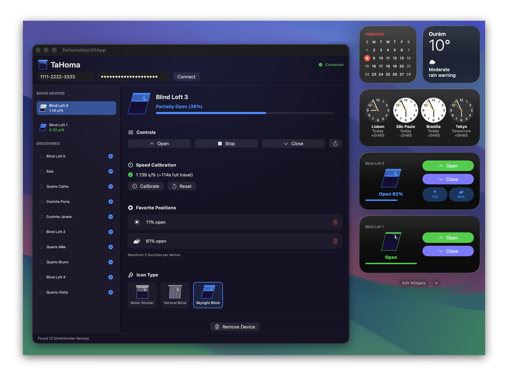

#  TaHoma macOS App

A macOS Notification Center widget and companion app to control Somfy TaHoma roller blinds via the local API.

I got tired of pulling out my phone every time I wanted to toggle my blinds. So I did what any reasonable person would do: I vibe coded an entire native macOS app for it.

<div align="center">
  
</div>

https://github.com/user-attachments/assets/a10c1f22-c5ea-484a-b933-5cf0f2e702eb

## Setup

### 1. Enable Developer Mode on TaHoma Gateway

> [Check the step by step with images and more detail here](https://github.com/Somfy-Developer/Somfy-TaHoma-Developer-Mode)

1. Open the Somfy TaHoma app on your phone
2. Go to the gateway settings
3. Tap the gateway firmware version **7 times** to unlock Developer Mode
4. A "Developer Mode" toggle will appear — enable it
5. Generate a bearer token and copy it

### 2. Find Your Gateway PIN

The gateway PIN is in the format `XXXX-XXXX-XXXX` and can be found:

- On the bottom label of your TaHoma gateway
- In the TaHoma app under gateway settings

### 3. Build and Run

1. Open `TaHomaMacOSApp.xcodeproj` in Xcode
2. Set your Development Team in both targets (TaHomaMacOSApp and BlindWidgetExtension)
3. Build and run the TaHomaMacOSApp app

### 4. Configure the App

1. Enter your gateway PIN (format: `XXXX-XXXX-XXXX`)
2. Paste the bearer token from step 1
3. Click "Connect" to discover devices
4. Select your devices from the list
5. Click "Save Selection"
6. Test the Open/Close/Stop buttons

### 5. Add the Widget

1. Right-click on your macOS desktop or Notification Center
2. Click "Edit Widgets..."
3. Search for "Blind Control"
4. Add the widget (Small or Medium size)

## Architecture

- **TaHomaMacOSApp** (main app): Configuration UI for entering credentials and selecting the device
- **BlindWidget** (widget extension): WidgetKit widget with AppIntents for controlling the blind
- **Shared**: API client, models, keychain helper, and configuration shared between both targets

The widget communicates with the TaHoma gateway over the local network using HTTPS with the bundled Overkiz root CA certificate for TLS validation.

## Development Notes

### Debug Flags

The `EMPTY_STATE_PREVIEW` compilation flag forces the app to skip loading saved credentials and devices on launch, so the onboarding empty state is always visible.

To toggle it, open the project in Xcode, select the **TaHomaMacOSApp** target, go to **Build Settings**, and search for **Swift Compiler - Custom Flags > Active Compilation Conditions** in the Debug row.

- **Enable:** add `EMPTY_STATE_PREVIEW` to the list
- **Disable:** remove `EMPTY_STATE_PREVIEW` from the list

### Logging

All logging uses macOS unified logging with subsystem `com.tahoma-macos-app`. Only `.error()` and `.fault()` levels are persisted — `.info()` disappears from log history. Stream logs in real time:

```bash
log stream --predicate 'subsystem == "com.tahoma-macos-app"' --level error
```

Log categories: `BlindTimeline`, `OpenBlindIntent`, `CloseBlindIntent`, `StopBlindIntent`, `SetPositionIntent`, `DeviceStore`.

Use `privacy: .public` for any dynamic values in os_log interpolation, otherwise they show as `<private>`.

### Restarting the Widget

After code changes, the widget extension process may keep running with stale code. Kill it to force a fresh load:

```bash
killall BlindWidgetExtension
```

The system will automatically relaunch it when the widget needs to render.

### WidgetKit Gotchas

- Widget intents must return quickly (a few seconds max) — WidgetKit may kill long-running intents
- Don't poll inside intents; use timeline `.after(interval)` so the provider polls instead
- WidgetKit auto-refreshes timelines after an intent's `perform()` returns
- `snapshot()` must be read-only — writing to shared cache corrupts timeline state tracking
- Somfy local API does NOT reliably report `core:MovingState = true` — the codebase uses a `PendingCommand` pattern instead

### Building from Command Line

```bash
/Applications/Xcode.app/Contents/Developer/usr/bin/xcodebuild \
  -project TaHomaMacOSApp.xcodeproj \
  -scheme TaHomaMacOSApp \
  -destination "platform=macOS" build
```

## Troubleshooting

- **"Hub unreachable"**: Ensure your Mac is on the same WiFi network as the TaHoma gateway
- **"Not configured"**: Open the TaHoma macOS App and complete the setup
- **TLS errors**: The Overkiz root CA is bundled; ensure both targets include `OverkizRootCA.der` in their resources
